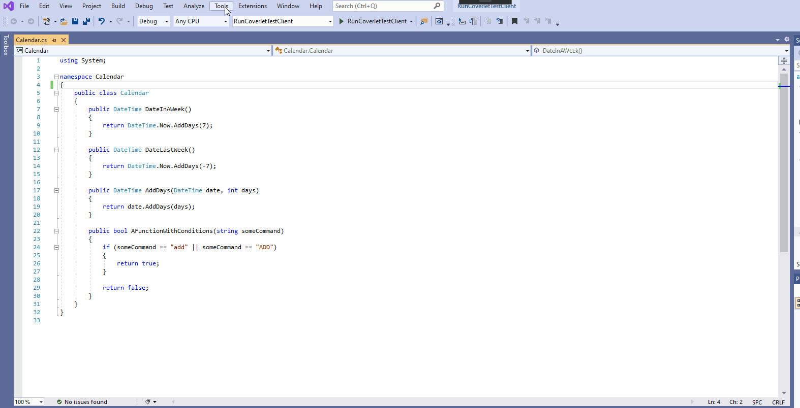

# Run Coverlet Report
A Visual Studio 2019 Extension to make showing code coverage easy.

## What is it
The aim of this extension is to make something similar to the functionality provided by the Enterprise edition of Visual Studio, without the cost.
Run Coverlet Report builds upon the excellent Coverlet and Report Generator tools that allow you to collect code coverage results from unit tests.
This extension will run the two tools and then display the report file within visual studio as well as use the Coverlet output to provide syntax highlighting.

For more information about coverlet see 
https://github.com/coverlet-coverage/coverlet

For more information about Report Generator see
https://danielpalme.github.io/ReportGenerator/

## Installation

1. Install the Visual Studio extension (from the extensions menu in Visual Studio)

2. Install Report Generator as a global tool
Follow this guide https://github.com/danielpalme/ReportGenerator/releases

3. In your unit test projects add the Coverlet.Collector nuget package.

## Usage
Once installed click Tools | Run Code Coverage in Visual Studio.
'dotnet test' will then execute your unit tests and after a few moments **(provided all of your tests pass)** a report generator window will open showing the ReportGenerator output. 
C# syntax in your .cs files will also be highlighted to indicate your code coverage. 

* Red background = uncovered code.
* Green background = covered code
* Orange background = a part covered line.

## Version History

### 1.7
Tweaked colours to make them stand out more, on some systems the transparency was too high which caused them to not show up.

### 1.6
First version made public on the Visual Studio Marketplace 